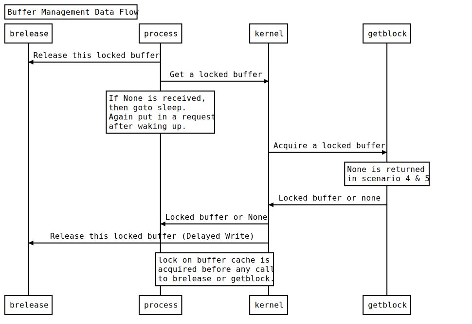

# Buffer Management System

> Implement a model of how buffer cache works in a system,
and show how the kernel and other processes interact to
get the desired effect.

## How to run

**Pre-requisites**

+ **Unix** Operating System
+ **Python** - v3.6 or higher
+ **Node** - v10 or higher
+ **npm** - v5.6 or higher

**Steps**

+ Run the shell script `gb_run`. If the shell script is
not executable run `chmod +x gb_run`, and then run `./gb_run`
+ After a while a browser window will pop-up, if the window
doesn't show anything then try refreshing the page.

## Data flow

## Modules

+ **Config**  
&nbsp;&nbsp;&nbsp;
Stores the specification details set by the superuser.

+ **buffer_header**  
&nbsp;&nbsp;&nbsp;
Implements the structure of a buffer(including buffer header).

+ **hash_queue**  
&nbsp;&nbsp;&nbsp;
Implements the Hash Queue frame.

+ **free_queue**  
&nbsp;&nbsp;&nbsp;
Implements the Free Queue frame.

+ **buffer_cache**  
&nbsp;&nbsp;&nbsp;
Implements the buffer cache(including the free list header).

+ **get_block**  
&nbsp;&nbsp;&nbsp;
Implements the function to allocate a buffer for a disk block.

+ **brelease**  
&nbsp;&nbsp;&nbsp;
Implements the function to de-allocate a disk block from a buffer.

+ **request**  
&nbsp;&nbsp;&nbsp;
Contains the classes to handle threading queues.

+ **Kernel**  
&nbsp;&nbsp;&nbsp;
Implements the kernel that interacts with the buffer cache
and various processes to service their needs.

+ **gb_run**  
&nbsp;&nbsp;&nbsp;
Contains shell script to run the module.

## Module details

### BufferHeader

BufferHeader is essentially the entire Buffer, but because
of the existing *buffer* library in python we had to name it
*BufferHeader*.

| Variable | Type | Definition |
| :---: | :---: | --- | 
| block_number    | Number         | Block Number whose data is in the buffer |
| process_id      | Number         | Process ID of the process using the buffer |
| status          | String         | Status of the buffer which is a combination of the various status states defined below |
| data            | String         | Data of the Block stored in the buffer |
| next_hash_queue | BufferHeader   | Next buffer in the Hash Queue |
| prev_hash_queue | BufferHeader   | Previous buffer in the Hash Queue |
| next_free_list  | BufferHeader   | Next buffer in the Free List |
| prev_free_list  | BufferHeader   | Previous buffer in the Free List |
| lock            | Threading Lock | Lock the buffer |

| Method | Definition |
| :---: | --- |
| get_status    | Returns the status of the buffer |
| set_status    | Sets the status of the buffer(keeping in mind that buffer status is a combination of the status states) |
| remove_status | Removes the status of the buffer |
  
&nbsp;&nbsp;

&nbsp;&nbsp;

### Status of a buffer

These status states are defined in the Config file.

| State Symbol (String) | State Name | State Meaning |
| :---: | --- | --- |
| 0 | BUSY            | Buffer is Busy(Locked) |
| 1 | FREE            | Buffer is Free(Unlocked) |
| 2 | VALID           | Buffer contains Valid data |
| 3 | ACCESS_DISK     | Some Process is reading or writing data from or to the disk |
| 4 | PROCESS_WAITING | Some Process is waiting for the buffer to become free |
| 5 | OLD             | Buffer is Old (already in free list) |
| 6 | NOT_OLD         | Buffer is not Old (just entered in free list) |

&nbsp;&nbsp;

&nbsp;&nbsp;

### Type of requests from a process

These requests are defined in the Config file.

| Request Type |
| :---: |
| Read |
| Write |
| Delayed Write |

&nbsp;&nbsp;

&nbsp;&nbsp;

### HashQueue

| Variable | Type | Definition |
| :---: | :---: | --- | 
| head  | BufferHeader | Buffer at the start of the hash queue |
| tail  | BufferHeader | Buffer at the end of the hash queue |

| Method | Definition |
| :---: | --- |
| add    | add the buffer to this particular hash queue |
| remove | remove the buffer from this particular hash queue |
| show   | returns the state of hash queue |

&nbsp;&nbsp;

&nbsp;&nbsp;

### FreeQueue

| Variable | Type | Definition |
| :---: | :---: | --- | 
| head  | BufferHeader | Buffer at the start of the free queue |
| tail  | BufferHeader | Buffer at the end of the free queue |

| Method | Definition |
| :---: | --- |
| add_to_tail      | add the buffer to the tail of the free queue |
| add_to_head      | add the buffer to the head of the free queue |
| is_empty         | returns true if free list is empty |
| remove           | remove the buffer from the free queue |
| remove_from_head | remove the buffer from the head of free queue |
| show             | returns the state of free queue |

&nbsp;&nbsp;

&nbsp;&nbsp;

### BufferCache

| Variable | Type | Definition |
| :---: | :---: | --- | 
| free_list          | FreeQueue         | Free List(initially containing all the buffers) |
| hash_queue_headers | List of HashQueue | Hash Queues (all of them initially empty) |

| Method | Definition |
| :---: | --- |
| in_hash_queue | Returns True if block is in the corresponding HashQueue |
| assign_block  | Returns the BufferHeader that contains the block (this function can only be called if in_hash_queue returns true) |
| show          | returns the state of buffer cache |

&nbsp;&nbsp;

&nbsp;&nbsp;

### get_block

This function implements the system call *getblk*

&nbsp;&nbsp;

&nbsp;&nbsp;

### brelease

This function implements the system call *brelease*

&nbsp;&nbsp;

&nbsp;&nbsp;

### Request

| Class | Definition |
| :---: | --- |
| Request | To create objects for get_block requests |
| ReleaseRequest | To create objects for get_block requests |

#### Class-Request
| Variable | Type | Definition |
| :---: | :---: | --- | 
| process_id   | Number             | Process id of the process which requested the block |
| block_number | Number             | Block number which is required |
| request_type | String             | Type of Request(Read/ Write/ Delayed write) |
| return_queue | BufferHeader-Queue | Buffer containing the block is returned in the queue |

#### Class-ReleaseRequest
| Variable | Type | Definition |
| :---: | :---: | --- | 
| process_id | Number       | Process id of the process which is releasing the block |
| block      | BufferHeader | The block which is to be released |

&nbsp;&nbsp;

&nbsp;&nbsp;

### kernel
It is the backbone of the module. It is divided into three broad categories.

| Category | Definition |
| :---: | --- |
| Queues          | So that at a moment only one process can access the resource |
| Daemon Threads  | Threads which runs till the life of the kernel and acts as a resource allocator |
| Process Threads | Threads which acts like a process and asks for blocks time to time |

+ **Queues**  

| Name | Definition |
| :---: | --- |
| request_queue | This queue contains get_block requests |
| print_queue   | This queue contains print requests |
|release_queue  | This queue contains brelease requests |

+  **Daemon Threads**  

| Name | Function | Definition |
| :---: | --- | --- |
| requests_thread |requests_manager | This thread accesses get_block algorithm |
| print_thread    | print_manager   | This thread accesses std_output |
| release_thread  | release_manager | This thread accesses brelease algorithm |

+ **Process Threads**  

| Name | Function | Definition |
| :---: | --- | --- |
| Process | worker | This thread acts as an arbitrary process |

+ **delay_func is a function used to manage asynchronous write.**
&nbsp;&nbsp;

&nbsp;&nbsp;
